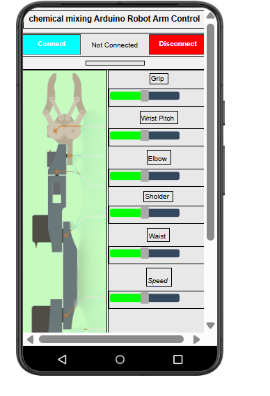

# Wireless Robotic Arm for Chemical Mixing Applications

> **A simulation-validated, 5-DOF robotic system designed to automate hazardous chemical handling via smartphone control.**

## 📌 Project Overview
This project presents a cost-effective solution for laboratory safety by automating chemical mixing tasks. Using an **Arduino Nano** and a custom **Android application**, the system allows researchers to perform precise mixing motions remotely, eliminating direct exposure to toxic, corrosive, or volatile substances. 

## 🚀 Key Features
* **5-DOF Articulated Design**: Optimized kinematic chain featuring Waist, Shoulder, Elbow, Wrist Pitch, and Gripper joints to maintain vertical stability for laboratory glassware.
* **Wireless Smartphone Control**: Custom-built interface using **MIT App Inventor** that communicates with the arm via an HC-05 Bluetooth module.
* **Motion Smoothing Algorithm**: Implemented C++ "Soft-Start/Soft-Stop" logic using incremental delay loops to prevent liquid sloshing and mechanical stress.
* **Input Sanitization**: Robust parsing layer that handles case-insensitive commands and whitespace trimming for high reliability across different control interfaces.
* **Hybrid Interface Support**: Capable of switching between independent embedded firmware and a PC-centric **MATLAB/Firmata** control mode for complex trajectory planning.

## 🛠️ Tech Stack
* **Microcontroller**: Arduino Nano (ATmega328P).
* **Wireless Comms**: HC-05 Bluetooth Module (SPP Protocol).
* **Actuators**: 5x SG90 Micro Servos.
* **Design & Simulation**: Proteus 8 Professional, MIT App Inventor.
* **Advanced Computation**: MATLAB R2023a (Support Package for Arduino).

## 📊 Simulation & Validation
The system logic was fully validated in a **Digital Twin** environment using Proteus ISIS. 
* **Real-time Link**: Established a 9600 bps wireless data bridge between the Android smartphone and the simulation engine with <20ms latency.
* **Safety Homing**: The system includes a pre-programmed safety sequence that returns all motors to "Home" positions (90°, 150°, 35°, 85°, 80°) upon startup to ensure a safe workspace.

## 📐 Pin Configuration
| Component | Function | Arduino Pin |
| :--- | :--- | :--- |
| Servo 1 | Waist (Base) | D5 |
| Servo 2 | Shoulder | D6 |
| Servo 3 | Elbow | D7 |
| Servo 4 | Wrist Pitch | D9 |
| Servo 5 | Gripper | D10 |
| Bluetooth | RX / TX | D0 / D1 |

---
*Developed for research in Laboratory Automation and Industry 4.0 applications.*
